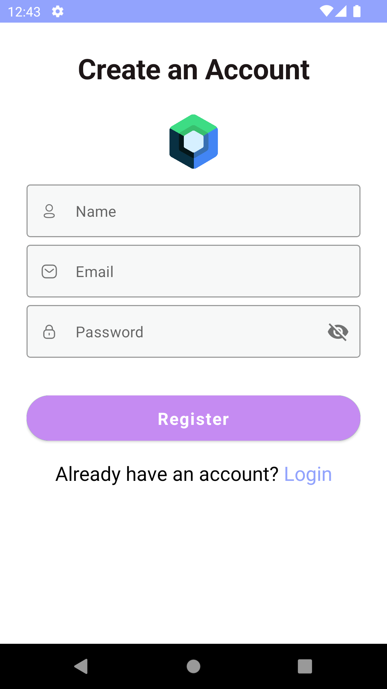

# LoginFeatureTemplateUsingJetpackCompose

This is a demo project that showcases how to create a login screen using Jetpack Compose in Android. The project uses the latest Android Jetpack Compose toolkit to build the UI. #Android #App using #JetpackCompose.

#**Advantages of JetPack Compose**
- It is very fast and offers a smooth performance.

- It’s simple to learn.

- It is possible to interoperate with an imperative approach.

- Offers a better way to implement loose coupling principles.

- It is 100% made in Kotlin which makes it a modern approach in Android development.

  

