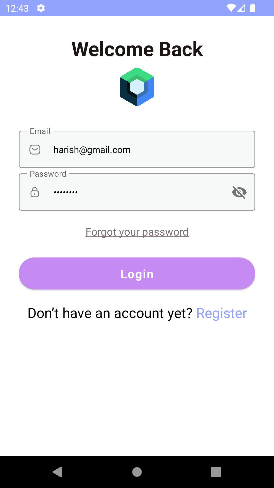

# LoginFeatureTemplateUsingJetpackCompose

This is a demo project that showcases how to create a login screen using Jetpack Compose in Android. The project uses the latest Android Jetpack Compose toolkit to build the UI. #Android #App using #JetpackCompose.

#**Requirements**

- Android Studio Arctic Fox or later 
- Android SDK 30 or later 
- Kotlin 1.5 or later 

  

